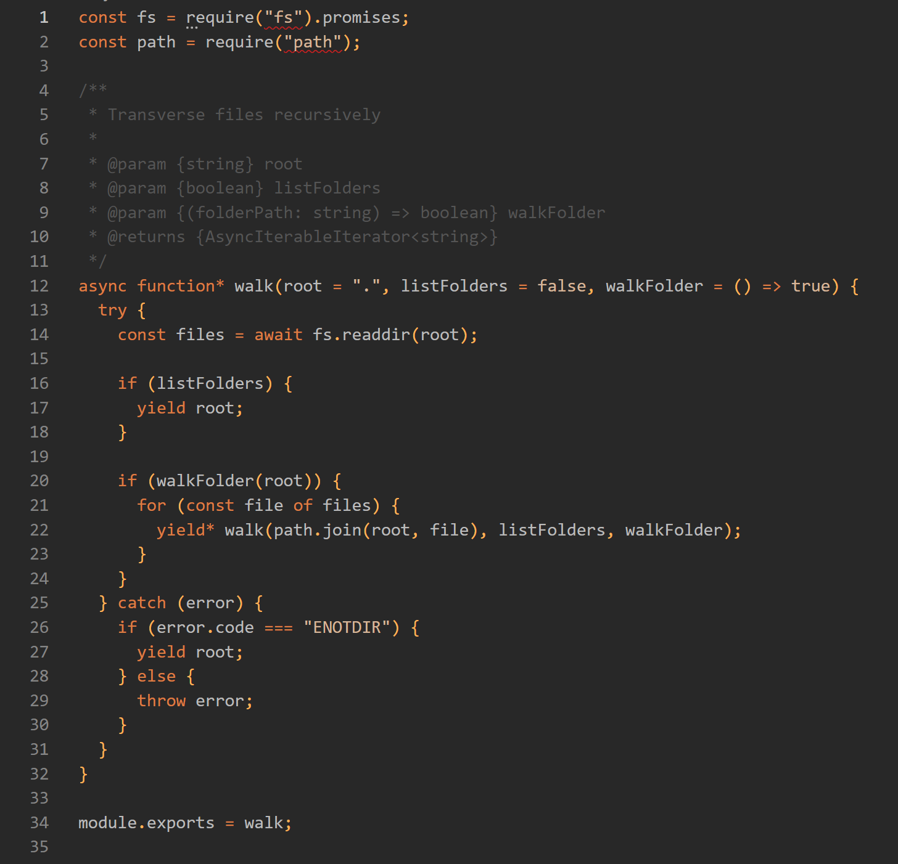

# Golden orange

Orange dark Vscode theme.

## Description

My goal was to make it easy to predict what colors the theme will display avoiding a myriad of random colors. If the token belongs to the language, it is colored, if it is a user defined identifier, then it is not.

I didn't edit an existing theme and I use it mostly on JavaScript, so if you find some issue with the theme, please let me know in order to fix it.

## Changelog

See [CHANGELOG](CHANGELOG.md)
